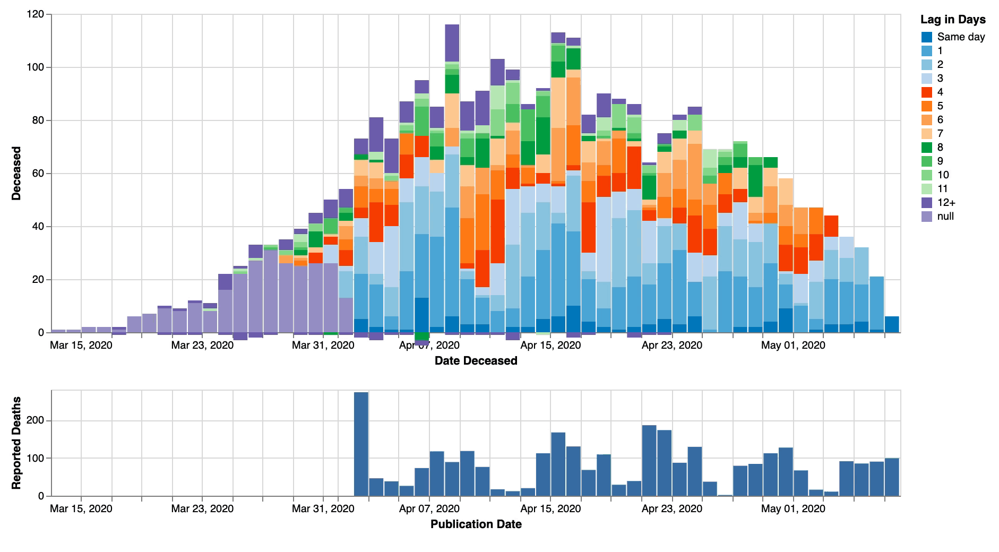
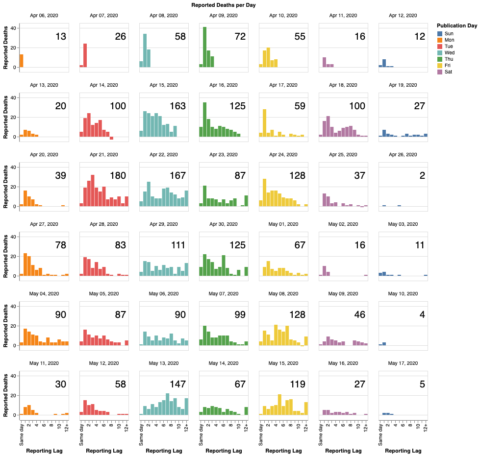
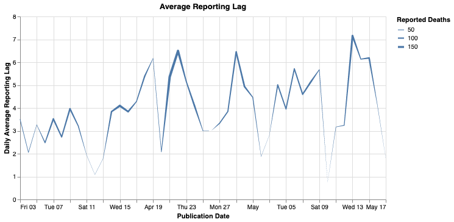

# Python notebooks for Swedish Covid-19 data
Notebooks for analysing Covid-19 data from FHM and mortality from SCB.

If you don't want to install a Jupyter notebook environment you can view the most useful charts on:

* [Covid statistics](https://morberg.github.io/covid-notebook/covid.html) (updated daily at 14:20)
* [Excess mortality](https://morberg.github.io/covid-notebook/excess.html) (updated weekly on Mondays)

## Reporting Lag
Based on data published by FHM and [processed by @adamaltmejd](https://github.com/adamaltmejd/covid).

### Daily reported deaths

[Interactive graph of daily deaths](https://morberg.github.io/covid-notebook/charts/filter-publication-date.html). Click and drag in bottom graph to select a time period for reported deaths to show in the upper graph.

### Daily reported deaths

[Histogram of reporting lag](https://morberg.github.io/covid-notebook/charts/daily-reported-deaths.html) for each reporting day. Column is weekday. Number is number of deaths reported that day.

### Average lag by reporting date

[Average lag](https://morberg.github.io/covid-notebook/charts/lag-chart.html) by reporting date. Line size is number of deaths reported each day.
